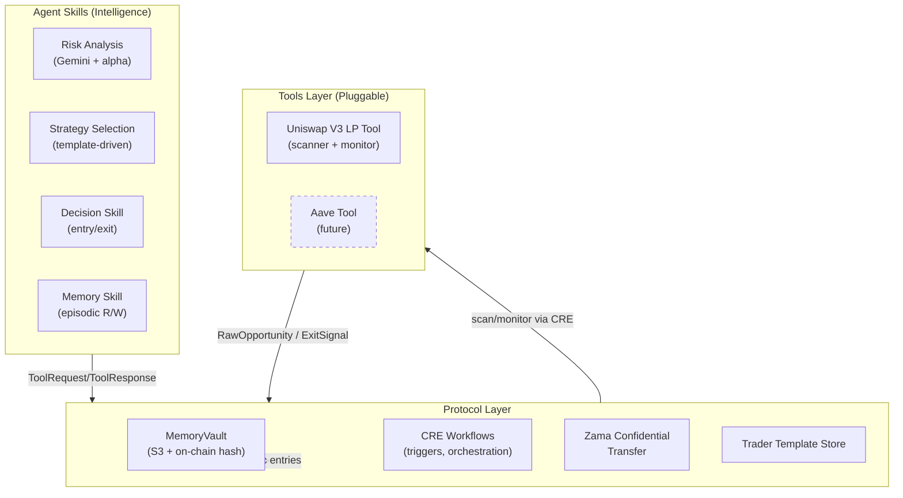

# MemoryVault Agent Protocol

A 3-layer protocol for autonomous DeFi AI agents with pluggable tools, private execution, and verifiable episodic memory — built on [Chainlink Runtime Environment (CRE)](https://docs.chain.link/cre).

> **Also in this repo:** `por/` — the original CRE Proof-of-Reserve + LLM demo. See [PoR Demo](#proof-of-reserve-llm-demo-por).

---

## What Is This?

Most DeFi agents today are monolithic: risk logic is coupled to specific protocols, privacy is an afterthought, and there's no tamper-proof record of why the agent made each decision.

**MemoryVault Agent Protocol** solves all three problems at once:

| Problem | Solution |
|---|---|
| Adding Aave = rewrite agent logic | **Standard Tool Interface** — each protocol = one CRE workflow. Agent skills don't change. |
| LP entries are front-run by MEV | **Zama Confidential Transfer Layer** — confidential token transfers for entry/exit |
| No way to audit AI decisions | **MemoryVault** — S3 encrypted + keccak256 hash on Sepolia, committed *before* every action |

---

## Architecture

```
┌──────────────────────────────────────────────────────────────────┐
│  AGENT SKILLS LAYER — Intelligence                               │
│                                                                  │
│  • Risk Analysis Skill: Gemini LLM + crypto-news51 alpha        │
│  • Strategy Skill:      template-driven (clmm_lp, snipe_exit)   │
│  • Decision Skill:      score/trust thresholds + exit triggers  │
│  • Memory Skill:        read/write episodic memory entries       │
└──────────────────────────────┬───────────────────────────────────┘
                               │ Standard Tool Interface
                               ▼
┌──────────────────────────────────────────────────────────────────┐
│  PROTOCOL LAYER — Infrastructure                                 │
│                                                                  │
│  • MemoryVault:      S3 encrypted + keccak256 on-chain hash     │
│  • CRE Orchestration: cron/HTTP triggers, workflow simulation   │
│  • Zama Transfer:    confidential LP entry/exit                  │
│  • Trader Template:  per-trader strategy + risk config          │
└──────────────────────────────┬───────────────────────────────────┘
                               │ CRE workflows (ToolRequest/ToolResponse)
                               ▼
┌──────────────────────────────────────────────────────────────────┐
│  TOOLS LAYER — Pluggable CRE Workflow Modules                    │
│                                                                  │
│  MVP:  Uniswap V3 LP Tool  (scanner + monitor)                  │
│  Next: Aave Lending Tool   (future — same interface)            │
│  Next: Curve LP Tool       (future — same interface)            │
└──────────────────────────────────────────────────────────────────┘
```



**Key repo paths:**

| Path | What lives here |
|---|---|
| `cre-memoryvault/protocol/` | Protocol CRE workflows (memory-writer, audit-reader, integrity-checker) + Standard Tool Interface types |
| `cre-memoryvault/tools/uniswap-v3-lp/` | MVP tool: scanner (cron) + monitor (cron) |
| `agent/` | Agent service + skills (risk-analysis, trader-template, zama-confidential-client, cre-trigger, memory-client) |
| `agent/templates/` | Pre-built trader strategy templates (JSON) |
| `contracts/` | `MemoryRegistry.sol` deployed to Sepolia |
| `server/` | Mock data API + Uniswap subgraph metrics adapter |
| `demo/` | End-to-end demo script + scenario helpers |

---

## Setup

### Prerequisites

| Requirement | Version | Notes |
|---|---|---|
| **Bun** | ≥ 1.2.21 | `bun --version` |
| **CRE CLI** | ≥ 1.3.0 | `cre --version` — get it at [docs.chain.link/cre](https://docs.chain.link/cre/getting-started/cli-installation) |
| **Foundry** | latest | Only needed to redeploy `MemoryRegistry.sol` — already deployed |
| **ETH on Sepolia** | — | For on-chain memory commits via `writeReport` |

### Install

```bash
# From repo root
bun install
```

### Configure environment

Copy `.env.sample` to `.env` and fill in values. The minimum set for running the agent:

```bash
# ── Blockchain ──────────────────────────────────────────────────
PRIVATE_KEY=0x...          # Sepolia EOA key (for CRE writeReport)
RPC_URL=https://sepolia.infura.io/v3/...

# ── Gemini (Risk Analysis Skill) ────────────────────────────────
GEMINI_API_KEY_VAR=...     # From https://aistudio.google.com/app/apikey

# ── Crypto-news51 (Alpha Fetcher) ───────────────────────────────
RAPIDAPI_KEY_VAR=...       # From https://rapidapi.com/apiwizard/api/crypto-news51

# ── AWS S3 (Episodic Memory) ────────────────────────────────────
AWS_ACCESS_KEY_ID_VAR=...
AWS_SECRET_ACCESS_KEY_VAR=...
# Bucket and region are set in cre-memoryvault/protocol/*/config.staging.json

# ── AES Encryption Key (for MemoryVault blobs) ──────────────────
AES_KEY_VAR=...            # 32-byte hex key, e.g. from: openssl rand -hex 32

# ── Zama Confidential Transfer ───────────────────────────────────
ZAMA_TRANSFER_MODE=simulate   # or onchain
ZAMA_RPC_URL=https://...
ZAMA_CHAIN_ID=11155111
ZAMA_CONFIDENTIAL_TOKEN_ADDRESS=0x...
ZAMA_PRIVATE_KEY=0x...        # optional, falls back to CRE_ETH_PRIVATE_KEY

# Required for onchain mode:
# map plaintext amount -> encrypted payload
ZAMA_ENCRYPTED_INPUTS_JSON={\"1000000000\":{\"handle\":\"0x...\",\"inputProof\":\"0x...\"}}

# Optional default payload if amount key is missing
ZAMA_DEFAULT_HANDLE=0x...
ZAMA_DEFAULT_INPUT_PROOF=0x...

LP_POSITION_CONFIDENTIAL_ADDRESS=0x...
HOLD_WALLET_CONFIDENTIAL_ADDRESS=0x...
```

`cre-memoryvault/.env` must contain the same secrets — the CRE CLI reads it when running workflow simulations. The easiest approach:

```bash
cp .env cre-memoryvault/.env
```

---

## Running the Demo

```bash
chmod +x demo/run-demo.sh
./demo/run-demo.sh
```

The script runs these steps:

| Step | What happens |
|---|---|
| 1 | Starts `server/mock-data-api.ts` (for scam scenario injection) |
| 2 | Injects `WETH/SCAMDEMO` pool into mock API via `demo/simulate-scenarios.ts` |
| 3 | Runs `cre workflow simulate tools/uniswap-v3-lp` — fetches real Uniswap V3 pools from The Graph subgraph |
| 4 | Runs `bun run agent/index.ts` — full agent loop (see below) |
| 5 | Runs `cre workflow simulate tools/uniswap-v3-lp --target monitor-staging-settings` — checks exit signals |
| 6 | Prints commands for audit log and tampering detection |

### What the agent loop does (step 4 in detail)

```
CRETrigger                     Risk Analysis Skill        Decision Skill
    │                               │                          │
    │  cre workflow simulate        │                          │
    │  tools/uniswap-v3-lp ────────►│  Gemini scoring          │
    │  (subprocess)                 │  + crypto-news51 alpha   │
    │◄── RawOpportunity[]           │◄── ScoredOpportunity[]   │
    │                               │                          │ filter
    │                               │                          │ score≥80
    │                               │                          │ trust≥75
    │                               │                          │ not SCAM
    │                               │                          │
    │               MemoryClient (before acting)               │
    │  cre workflow simulate protocol/memory-writer ───────────┘
    │  → XOR-encrypt → S3 PUT → keccak256 → MemoryRegistry.sol
    │
    │  Zama confidential transfer (simulate or onchain mode)
    │
    │  MemoryClient (confirm after acting)
    │  cre workflow simulate protocol/memory-writer
```

### Running individual workflows manually

```bash
# Scanner (fetches live Uniswap V3 pools from The Graph)
cd cre-memoryvault
cre workflow simulate tools/uniswap-v3-lp \
  --target staging-settings --trigger-index 0 --non-interactive

# Monitor (checks active positions for exit signals)
cre workflow simulate tools/uniswap-v3-lp \
  --target monitor-staging-settings --trigger-index 0 --non-interactive

# Memory Writer (commit an entry to S3 + Sepolia)
cre workflow simulate protocol/memory-writer \
  --target staging-settings --trigger-index 0 --non-interactive \
  --http-payload '{"agentId":"agent-alpha-01","entryKey":"test-01","entryData":{"action":"test","toolId":"uniswap-v3-lp"}}'

# Audit Reader (read + verify full decision log)
cre workflow simulate protocol/audit-reader \
  --target staging-settings --trigger-index 0 --non-interactive \
  --http-payload '{"agentId":"agent-alpha-01"}'

# Integrity Checker (detect tampered S3 blobs)
cre workflow simulate protocol/integrity-checker \
  --target staging-settings --trigger-index 0 --non-interactive

# Agent service
AGENT_ID=agent-alpha-01 bun run agent/index.ts
```

### Switching trader strategies

```bash
# Conservative CLMM LP farmer (score≥80, trust≥75, up to 3 concurrent positions)
AGENT_ID=agent-alpha-01 bun run agent/index.ts

# Aggressive snipe-and-exit (score≥75, trust≥70, up to 5 concurrent, profit target 2.5x)
AGENT_ID=agent-gamma-01 bun run agent/index.ts
```

Templates live in `agent/templates/{agentId}.json`. Edit `customInstructions` to change how the Gemini LLM weights signals without touching any code.

---

## How to Add a New Tool

This is the **core extensibility story**. Adding a new DeFi protocol (e.g., Aave) requires:

- **One new CRE workflow directory** implementing the Standard Tool Interface
- **One line added to a trader template** (`strategy.tools`)
- **Zero changes** to agent skills, protocol workflows, or MemoryVault

### Step 1 — Create the tool directory

```bash
mkdir -p cre-memoryvault/tools/aave-lending
cd cre-memoryvault/tools/aave-lending
bun init   # or copy from tools/uniswap-v3-lp/package.json
```

### Step 2 — Implement the `scan` CRE workflow (`scanner.ts`)

The `scan` action fetches **public** protocol data via `HTTPClient` (no trader secrets needed) and returns `RawOpportunity[]`. The Risk Analysis Skill handles scoring.

```typescript
// cre-memoryvault/tools/aave-lending/scanner.ts
import { cre, CronCapability, handler, ok, type Runtime, Runner } from '@chainlink/cre-sdk'
import { z } from 'zod'
import type { ToolResponse, RawOpportunity } from '../../protocol/tool-interface'

const configSchema = z.object({
  schedule: z.string(),
  aaveSubgraphUrl: z.string(),
  minTVL: z.number().default(1_000_000),
})

export const onCronTrigger = (runtime: Runtime<z.infer<typeof configSchema>>): ToolResponse => {
  const httpClient = new cre.capabilities.HTTPClient()

  // Fetch public Aave market data (TVL, borrow/supply rates, etc.)
  const resp = httpClient.sendRequest(runtime, {
    url: runtime.config.aaveSubgraphUrl,
    method: 'POST',
    body: /* base64(JSON.stringify({ query: '{ markets { ... } }' })) */ '',
  }).result()

  if (!ok(resp)) throw new Error(`Aave subgraph error: ${resp.statusCode}`)
  const { markets } = JSON.parse(new TextDecoder().decode(resp.body)).data

  const opportunities: RawOpportunity[] = markets
    .filter((m: any) => Number(m.totalValueLockedUSD) >= runtime.config.minTVL)
    .map((m: any) => ({
      toolId: 'aave-lending',
      assetId: m.id,                  // market address
      entryParams: {
        market: m,
        supplyAPY: m.supplyRate,
        borrowAPY: m.borrowRate,
        ltv: m.maximumLTV,
        tvlUsd: m.totalValueLockedUSD,
      },
    }))

  return { status: 'success', action: 'scan', toolId: 'aave-lending', data: {}, opportunities }
}

const initWorkflow = (config: z.infer<typeof configSchema>) => [
  handler(new CronCapability().trigger({ schedule: config.schedule }), onCronTrigger),
]

export async function main() {
  const runner = await Runner.newRunner<z.infer<typeof configSchema>>({ configSchema })
  await runner.run(initWorkflow)
}
main()
```

**Key rule**: tools return `RawOpportunity[]` with **no scores**. The Risk Analysis Skill adds `opportunityScore`, `trustScore`, `riskLevel`, and `reasoning` — for any tool, without changes.

### Step 3 — Implement the `monitor` CRE workflow (`monitor.ts`)

The monitor checks active positions and returns `ExitSignal[]` when thresholds are breached.

```typescript
// cre-memoryvault/tools/aave-lending/monitor.ts
import type { ToolResponse, ExitSignal } from '../../protocol/tool-interface'

export const onCronTrigger = (runtime: Runtime<...>): ToolResponse => {
  // Load active positions from config or a runtime store
  const positions = runtime.config.activePositionMarketIds ?? []

  const exitSignals: ExitSignal[] = []

  for (const marketId of positions) {
    const data = fetchMarketData(runtime, marketId)

    const signals: ExitSignal[] = [
      { trigger: 'ltv_breach',  urgency: 'critical', data: { ltv: data.ltv,  fired: data.ltv > 0.85 } },
      { trigger: 'rate_spike',  urgency: 'high',     data: { apy: data.borrowAPY, fired: data.borrowAPY > 0.20 } },
      { trigger: 'tvl_crash',   urgency: 'critical', data: { change4h: data.tvlChange4h, fired: data.tvlChange4h < -0.20 } },
    ].filter(s => s.data.fired)

    exitSignals.push(...signals)
  }

  return { status: 'success', action: 'monitor', toolId: 'aave-lending', data: {}, exitSignals }
}
```

### Step 4 — Add a `workflow.yaml` and `config.staging.json`

Copy from `tools/uniswap-v3-lp/workflow.yaml` and `config.staging.json` and adapt:

```yaml
# cre-memoryvault/tools/aave-lending/workflow.yaml
name: aave-lending
targets:
  staging-settings:
    config: ./config.staging.json
  monitor-staging-settings:
    config: ./config.monitor.staging.json
```

```json
// cre-memoryvault/tools/aave-lending/config.staging.json
{
  "schedule": "0 */4 * * *",
  "aaveSubgraphUrl": "https://gateway.thegraph.com/api/<key>/subgraphs/id/<aave-v3-id>",
  "minTVL": 1000000
}
```

### Step 5 — Register the tool in `CRETrigger`

Add one entry to the map in `agent/cre-trigger.ts`:

```typescript
// agent/cre-trigger.ts
const TOOL_WORKFLOW_DIRS: Record<string, string> = {
  'uniswap-v3-lp': 'tools/uniswap-v3-lp',
  'aave-lending':  'tools/aave-lending',   // ← add this
}
```

### Step 6 — Add the tool to a trader template

Edit `agent/templates/agent-alpha-01.json` (or create a new template):

```json
{
  "agentId": "agent-alpha-01",
  "strategy": {
    "type": "clmm_lp",
    "tools": ["uniswap-v3-lp", "aave-lending"],
    "entryThresholds": { "minOpportunityScore": 80, "minTrustScore": 75, "maxRiskLevel": "MEDIUM" },
    "exitTriggers": ["ltv_breach", "rate_spike", "tvl_crash", "apy_drop"]
  }
}
```

### Step 7 — Run it

```bash
AGENT_ID=agent-alpha-01 bun run agent/index.ts
```

The agent will now iterate both tools, score with the same Risk Analysis Skill, filter with the same Decision Skill, and commit reasoning to the same MemoryVault. **No agent code changed.**

---

## Trader Templates

Templates (`agent/templates/*.json`) configure everything about how an agent behaves. The `customInstructions` field is injected directly into the Gemini system prompt — traders can personalize risk assessment without any code changes.

| Template | `agentId` | Strategy | Behavior |
|---|---|---|---|
| `clmm_lp.json` | `agent-alpha-01` | `clmm_lp` | Score≥80, trust≥75, up to 3 positions, 2x profit target |
| `snipe_and_exit.json` | `agent-gamma-01` | `snipe_and_exit` | Score≥75, trust≥70, up to 5 positions, 2.5x target, focus on early volatile pools |

### Configuring alpha sources

The `alpha` field in the template controls which news/data sources the Risk Analysis Skill queries for each opportunity:

```json
{
  "agentId": "agent-alpha-01",
  "alpha": {
    "sources": [
      {
        "id": "crypto-news51",
        "description": "24h crypto news via RapidAPI",
        "secretEnvVar": "RAPIDAPI_KEY_VAR"
      }
    ]
  }
}
```

If `alpha.sources` is empty or missing, the skill falls back to the default provider (`RAPIDAPI_KEY_VAR` from env). Add your own sources by implementing additional `AlphaFetcher` implementations in `agent/alpha-fetcher.ts`.

---

## MemoryRegistry.sol

The on-chain anchor for all agent memory entries.

- **Network:** Ethereum Sepolia
- **Address:** `0x61C7120F79f17bf9e46dC14251efe5a2659aEfb1`
- **Source:** `contracts/src/MemoryRegistry.sol`

Every `memory-writer` CRE workflow call commits a `keccak256` hash of the plaintext entry data to this contract *before* the agent takes any action. The `audit-reader` and `integrity-checker` workflows verify each S3 blob by re-hashing the decrypted content and comparing against on-chain commitments.

```solidity
// MemoryRegistry.sol (simplified)
struct Commitment {
    string  agentId;
    string  entryKey;
    bytes32 entryHash;   // keccak256 of plaintext entryData JSON
    uint256 committedAt; // block.timestamp (immutable, on-chain proof)
}

mapping(bytes32 => Commitment) public commitments;
mapping(string => bytes32[])   public agentHashes;
```

---

## Hedera Deployment

**First real HCS transaction on Hedera testnet** — HCS-11 profile inscription, TX `0.0.2659396-1774285643-082305883`, confirmed SUCCESS.

Verify: `https://testnet.mirrornode.hedera.com/api/v1/transactions/0.0.2659396-1774285643-082305883`

Full status and run instructions: [agent/README.md](agent/README.md)

---

## Privacy Model

| Who | What they can see |
|---|---|
| On-chain observers | MemoryRegistry hash commitments only (no content). Confidential transfer amounts are ciphertext handles/proofs. |
| AWS S3 / storage | Encrypted blobs only (XOR cipher with AES key in CRE secrets vault) |
| CRE DON nodes | Encrypted workflow I/O (inside enclave). API keys never leave the vault. |
| Fund owner / auditor | Full decrypted decision log via `audit-reader` (with AES key) |

> **Note:** Private transfer execution now routes through `zama-confidential-client.ts`. Use `ZAMA_TRANSFER_MODE=simulate` for local runs without on-chain confidential transfer prerequisites.

---

## CRE WASM Constraints

CRE compiles TypeScript workflows to WASM via Bun + Javy. This affects workflow code only (not the agent service):

| Constraint | Workaround |
|---|---|
| No `crypto.subtle` / `crypto.getRandomValues` | Use `keccak256` from viem (the only hash available) |
| No `btoa` / `atob` | Implement manual base64 encode/decode (see `memory-writer/main.ts`) |
| No shared utils across workflow directories | Inline helpers directly in each workflow's `main.ts` |
| `runtime.now()` returns `Date`, not `number` | Convert via `new Date(String(runtime.now())).getTime()` |
| `runtime.getSecret()` is sequential | Fetch secrets one at a time — no parallel `.result()` calls |
| `gasLimit` must be a string | Use `z.string()` in config schema for `gasLimit` field |
| Secret name substring collision (`_VAR` suffix) | Append `_VAR` to all env var names in `secrets.yaml` |

---

## Proof-of-Reserve LLM Demo (PoR)

The original PoR demo lives under `por/` and works as a standalone example.

**What it does:**
- Fetches off-chain reserve data via HTTP
- Reads on-chain token total supply
- Calls Gemini LLM to compute a coverage-based risk score
- Commits the report (reserve, supply, score) on-chain via `writeReport`

**Run it:**

```bash
bun install --cwd ./por
cp .env.sample .env   # set PRIVATE_KEY and GEMINI_API_KEY_VAR

cre workflow simulate por                   # simulate only
cre workflow simulate por --broadcast       # simulate + broadcast to Sepolia
```

### Workshop

- [Chapter 1 — CRE CLI Setup](/workshop/chapter-1.md)
- [Chapter 2 — CRE Basics](/workshop/chapter-2.md)
- [Chapter 3 — PoR Demo](/workshop/chapter-3.md)
